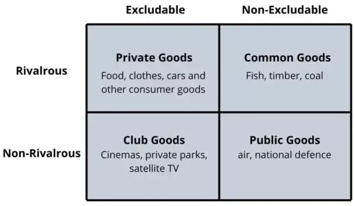

# Common-Pool Resources

[@\_fsantanna](https://twitter.com/_fsantanna)

Previous: Freechains vs the [Tragedy of the Commons](tragedy.md)

<!--
https://boycewire.com/what-are-the-4-types-of-economic-goods/
-->

Common-Pool Resources (CPRs) refer to resource systems that are too large to
exclude outsiders from obtaining benefits from its use, but that are at the
same time subject to scarcity.
Fishing grounds are a typical example of a CPR, because fishes are scarce
resources, while access to predatory fishers cannot be easily prevented.

CPRs are in between Public and Private Goods, because access to resources is
non-excludable but rivalrous, i.e., everyone can extract a resource that is
scarce.

In her [seminal work][1], Elinor Ostrom proposes [eight principles][2] to
manage renewable CPRs and avoid the [tragedy of the commons][3].
She noticed that a number of successful CPRs are decentralized community-driven
alternatives to private corporations and state administration.

# Internet Forums as Common-Pool Resources

We can see public internet forums and social media as renewable CPRs:
The shared resources here are people's attention and engagement, which are
"extracted" by writing in the forums.
In principle, anyone can publish to public forums to get attention.
However, the more content there is in a forum, the less reach and attention
each post gets individually.
People have limited time to consume and interact with content, but which renews
every day.
In the limit, if the amount of content tends to infinite, then the average of
attention each post gets tends to zero.
This is the tragedy of the commons we want to avoid with the reputation system
of Freechains.

# Freechains and Ostrom's Principles

In her book, Ostrom proposes eight design principles to make participants
conform with the operation and vigilance of CPRs.

We argue that the reputation and consensus mechanism of Freechains adheres
to Ostrom's principles.

We use a less academic description of the eight principles found [here][4]:

<!--
1. **Clearly defined boundaries.**
   *Individuals or households who have rights to withdraw resource units from
   the CPR must be clearly defined, as must the boundaries of the CPR itself.*
-->

1. **Commons need to have clearly defined boundaries.**
    *In particular, who is entitled to access to what? Unless there's a
    specified community of benefit, it becomes a free for all, and that's not
    how commons work.*

In Freechains, only authors with previous reputation can post in the forums.
New participants require welcoming likes form existing participants.
Furthermore, posts and their engagements only affect the forums in which they
are posted.

<!--
2. **Congruence between appropriation and provision rules and local conditions.**
    *Appropriation rules restricting time, place, technology, and/or quantity
    of resource units are related to local labor, material, and/or money.
-->

2. **Rules should fit local circumstances.**
    *There is no one-size-fits-all approach to common resource management.
    Rules should be dictated by local people and local ecological needs.*

Each forum has its own informal netiquette, which is defined by or (evolves
with) the community itself.

<!--
3. **Collective-choice arrangements**
    *Most individuals affected by the operational rules can participate in
    modifying the operational rules.*
-->

3. **Participatory decision-making is vital.**
    *People will be more likely to follow the rules if they had a hand in
    writing them. Involve as many people as possible in decision-making.*

A forum netiquette is the result of a history of posts and feedback of
participants with likes and dislikes over the time.
There is nothing external to user-generated content from participants in the
forum.

<!--
4. **Monitoring.**
    *Monitors, who actively audit CPR conditions and appropriator behavior, are
    accountable to the appropriators or are the appropriators.*
-->

4. **Commons must be monitored.**
    *Communities need a way of checking that people are keeping them. Commons
    don't run on good will, but on accountability.*

All content remains publicly available in the forums and any abusive behavior
can be detected by members.
Furthermore, the reputation of each member can be consulted at any time.

<!--
5. **Graduated sanctions.**
    *Appropriators who violate operational rules are likely to be assessed
    graduated sanctions (depending on the seriousness and context of the
    offense) by other appropriators, by officials accountable to these
    appropriators, or by both.*
-->

5. **Sanctions for those who abuse the commons should be graduated.**
    *Commons that worked best didn't just ban people who broke the rules. That
    tended to create resentment. Instead, they had systems of warnings and
    fines, as well as informal reputational consequences in the community.*

Dislikes serve as warnings that gradually reduce the reputation of abusive
posts and their authors.
If the number of dislikes crosses a threshold, a post can be revoked forum and
its author banned from the forum.

<!--
6. **Conflict-resolution mechanisms**
    *Appropriators and their officials have rapid access to low-cost local
    arenas to resolve conflicts among appropriators or between appropriators
    and officials.*
-->

6. **Conflict resolution should be easily accessible.**
    *When issues come up, resolving them should be informal, cheap and
    straightforward. That means that anyone can take their problems for
    mediation, and nobody is shut out. Problems are solved rather than ignoring
    them because nobody wants to pay legal fees.*

Forums are open to discussion and maintain a persistent and transparent
archive.
Likes and dislikes provide instant feedback.

<!--
7. **Minimal recognition of rights to organize**.
    *The rights of appropriators to devise their own institutions are not
    challenged by external governmental authorities.*
-->

7. **Commons need the right to organise.**
    *Your commons rules won't count for anything if a higher local authority
    doesn't recognise them as legitimate.*

Freechains is an open protocol working on top of the Internet infrastructure.

<!--
8. **Nested enterprises**.
    *Appropriation, provision, monitoring, enforcement, conflict resolution,
    and governance activities are organized in multiple layers of nested
    enterprises.*
-->

8. **Commons work best when nested within larger networks.**
    *Some things can be managed locally, but some might need wider regional
    cooperation.*

Given the open nature of the protocol, public forums can be monitored by
government authorities, and are still subject to law enforcement regarding
illegal content.

Ostrom concludes that long-enduring CPRs rely on the correlation between these
design principles:

*When CPR participants design their own operational rules (principle 3) to be
enforced by individuals who are local participants or are accountable to them
(principle 4), using graduated sanctions (principle 5) that define who has
rights to withdraw units front the CPR (principle 1) and that effectively
restrict appropriation activities, given local conditions (principle 2), the
commitment and monitoring problem are solved in an interrelated manner.*

[1]: https://www.cambridge.org/core/books/governing-the-commons/7AB7AE11BADA84409C34815CC288CD79
[2]: https://www.onthecommons.org/magazine/elinor-ostroms-8-principles-managing-commmons
[3]: https://en.wikipedia.org/wiki/Tragedy_of_the_commons
[4]: https://earthbound.report/2018/01/15/elinor-ostroms-8-rules-for-managing-the-commons/

<!--
https://earthbound.report/2017/12/19/book-review-elinor-ostroms-rules-for-radicals-by-derek-wall/
-->

---

- Do you see public forums as common-pool resources?
- Is Freechains conformant with Ostrom's eight principles?

Comment on 
[@\_fsantanna](https://twitter.com/_fsantanna/status/TODO).
