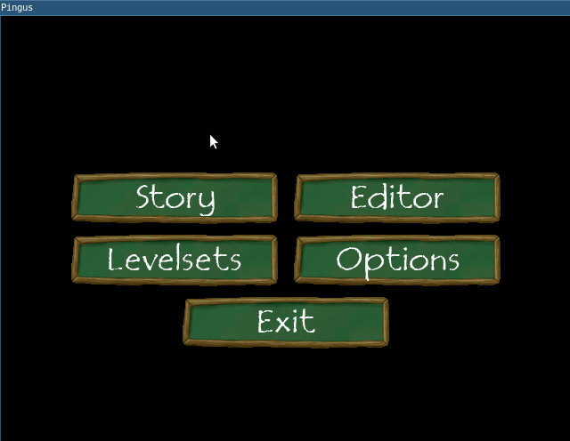

# Menu buttons as local tasks

[@\_fsantanna](https://twitter.com/_fsantanna)

- On rewriting [Pingus](pingus.md) from C++ to Ceu
    - A structured [main menu](menu.md)
    - **Menu buttons as local tasks** 👈 (this post)
    - A self-reacting [button](button.md)
    - A structured main menu: [full code](menu-full.md)

In the [previous post](menu.md), we discussed the outermost code to alternate
between the main menu and the chosen screens:

<pre>
-- enumeration with the possible menu choices
<b>type</b> Menu = <Story=(), Editor=(), ...>

-- task signatures for the menu and buttons
<b>task</b> main_menu: () -> Menu                       👈 (this post)
    -- returns the chosen screen to navigate
<b>task</b> menu_button: [pos:Point, lbl:String] -> ()  👈 (next post)
    -- receives a position and label to show

-- spawns the game code
<b>spawn</b> {
    -- the outer loop
    <b>loop</b> {
        -- main menu
        <b>var</b> opt = <b>await</b> <b>spawn</b> main_menu ()

        -- chosen screen
        <b>var</b> lbl = <b>ifs</b> {
            opt ? Story  { "Story"  }
            opt ? Editor { "Editor" }
            ... -- other options
        }
        <b>await</b> <b>spawn</b> menu_button [[0,0], lbl]

        -- loops back to menu after screen terminates
    }
}

-- enters the SDL engine loop
<b>call</b> pico_loop ()
</pre>

---

Following the top-down approach, in this post, we discuss the `main_menu` and
leave the `menu_button` implementation for the next post.
The `main_menu` task spawns a set of `menu_button` tasks in parallel (1️⃣), each
one corresponding to a menu option.
The menu then returns the clicked option to the outermost code as an
enumeration (2️⃣):

<pre>
<b>task</b> main_menu: () -> Menu {
    <b>par</b> {
        <b>await</b> <b>spawn</b> menu_button [[-125,35], "Story"]    1️⃣
        <b>return</b> Menu.Story                               2️⃣
    } <b>with</b> {
        <b>await</b> <b>spawn</b> menu_button [[ 125,35], "Editor"]   1️⃣
        <b>return</b> Menu.Editor                              2️⃣
    } <b>with</b> {
        ... -- other options (1️⃣,2️⃣)
    }
}
</pre>

The `main_menu` task expects that a `menu_button` terminates when it is clicked
(1️⃣) in order to return the corresponding enumeration (2️⃣).
Like in the outermost code, we use the direct style of `spawn-await` to nest
arbitrary tasks.
Here, we also use the `par` composition whose branches expand to anonymous
tasks that capture their enclosing lexical context.
For instance, note that the `return` terminates the enclosing `main_menu` as a
whole, disregarding the anonymous task between them.
I believe that this kind of mechanism is not possible in programming languages
that provide [structured concurrency](../sc.md) exclusively as a library.

Finally, the most relevant structured mechanism in this code is how Ceu handles
the lifespan of tasks.
A task is like a local variable, i.e., its lifespan is attached to the block
enclosing it.
In the `main_menu`, each `par` branch spawns an anonymous task, and each
anonymous task spawns a `menu_button` task.
Hence, the menu as a whole handles at least 2x tasks for each menu option,
which are all active at the same time.
When a `return` is reached, it escapes all blocks in the parent task, aborting
all nested tasks automatically.
This hierarchy of tasks is one of the control-flow patterns described in the
[previous post](pingus.md):

- **Lifespan Hierarchies:** Entities typically form a lifespan hierarchy in
   which a terminating container entity automatically destroys its managed
   children.
    - Examples: UI containers, particle systems.

The original implementation in C++ relies on an [explicit container][1] to hold
the buttons, which are destroyed together with the menu object.
In comparison to local tasks, the main drawbacks of object containers are that
    (1) all nested objects share the same lifespan of the container, and
    (2) the lifespan of the container matches the lifespan of its enclosing
        object.
As a result, lifespan hierarchies in containers cannot be fine grained unless
they rely on manual management (e.g., through `add` and `remove` method calls).

[1]: https://github.com/Pingus/pingus/blob/master/src/pingus/screens/pingus_menu.cpp#L52

---

- Are there similar mechanisms for anonymous tasks in other languages?
- Do you agree that object containers cannot express fine-grained lifespans
  automatically?

Comment on 
[@\_fsantanna](https://twitter.com/_fsantanna/status/1509494376589926404).
