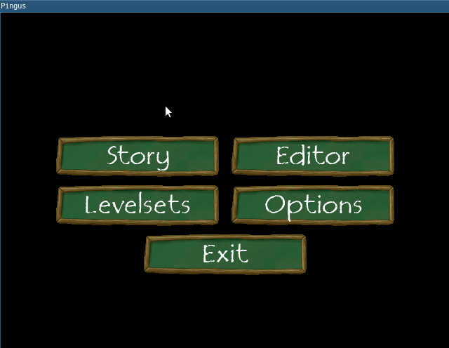

# A structured main menu


[@\_fsantanna](https://twitter.com/_fsantanna)

- On rewriting [Pingus](pingus.md) from C++ to Ceu
    - **A structured main menu**
    - Menu [buttons](buttons.md) as tasks



A main menu typically displays a set of buttons that allows players to navigate
the game.
Selecting a button transfers the game to another screen, such as an options
screen or the gameplay itself.
Eventually, after the chosen screen terminates, the game transits back to the
main menu.

In the figure demonstrating our implementation, we symbolize the chosen screens
as clickable buttons associated with the user choices.
Clicking the button again terminates the screen and returns to the main menu.
Our goal is to apply [structured reactive techniques](pingus.md) in the
implementation.
Let's discuss it in a top-down approach, starting with the main application:

<pre>
-- enumeration with the possible main menu choices
<b>type</b> Menu = <Story=(), Editor=(), ...>

-- task signatures for the menu and buttons
<b>task</b> main_menu: () -> Menu
    -- returns the next screen to navigate
<b>task</b> menu_button: [pos:Point, lbl:String] -> ()
    -- receives a position and label to show

-- spawns the game code
<b>spawn</b> {
    -- the outer loop                           1️⃣
    <b>loop</b> {
        -- main menu
        <b>var</b> opt = <b>await</b> <b>spawn</b> main_menu ()      2️⃣

        -- chosen screen
        <b>var</b> lbl = <b>ifs</b> {
            opt ? Story  { "Story"  }
            opt ? Editor { "Editor" }
            ... -- other options
        }
        <b>await</b> <b>spawn</b> menu_button [[0,0], lbl]    2️⃣

        -- loops back to main menu after chosen screen terminates
    }
}

-- enters the SDL engine loop
<b>call</b> pico_loop ()
</pre>

The important structured mechanism is the outer loop (1️⃣) that alternates
between the main menu and the chosen screen.
These screens can be arbitrarily complex and are handled with the `spawn-await`
combination (2️⃣), which resembles conventional function calls: spawn the task
and await its termination.
We discuss the `main_menu` and the `menu_button` implementations in a future
post.
While waiting in the loop, the language keeps its context alive (i.e., locals
and program counter), and the current screen executes in a separate task,
possibly reacting to events and spawning auxiliary tasks.
This [direct style][1] contrasts with the arguably more intricate *continuation
passing style (CPS)*, which is one of the control-flow pattern identified in
the [previous post](pingus.md):

2. **Continuation Passing:** The completion of a long-lasting activity may
   carry a continuation, i.e., some action to execute next.
    - Examples: interactive dialogs, menu transitions.

The original [implementation in C++][2] uses CPS and pushes the screen
navigation to occur inside the button click callback:

```cpp
MainMenu::MainMenu () {
    ...
    start_but = gui->create<MenuButton>(...)
    ...  // other menu buttons
}

void MainMenu::on_click (MenuButton* button) {
    if (button == start_but) {
        ...
        Screen::push_screen(worldmap);        // screen navigation
        ...
    } else ... {    // other buttons
        ...
    }
}
```

The [implementation in C++][3] also relies on an explicit stack to alternate
between the main menu and the chosen screen:
It pushes a new screen on top of the main menu, which must be explicitly popped
when terminating:

```cpp
void Worldmap::update (float delta) {
    ...
    if (exit_worldmap) {
        Screen::pop_screen();
    }
    ...
}
void WorldmapCloseButton::on_click() {
    Screen::pop_screen();
}
```

Not only this approach requires the called screen to be aware of its parent
navigation flow, but it also relies on a data structure to simulate a
control-flow mechanism.

[1]: https://handwiki.org/wiki/Direct_style
[2]: https://github.com/Pingus/pingus/blob/master/src/pingus/screens/pingus_menu.cpp#L178
[3]: https://github.com/Pingus/pingus/blob/master/src/pingus/worldmap/worldmap_screen.cpp#L179

Comment on  [@\_fsantanna](https://twitter.com/_fsantanna/status/TODO).

