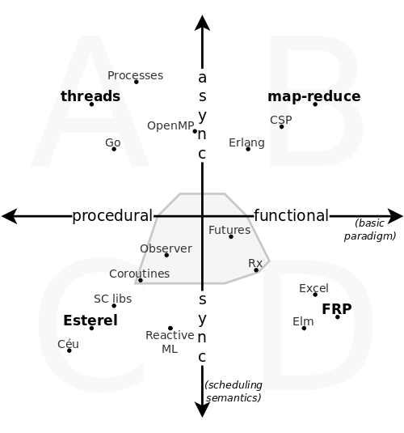

# Structured (Synchronous) Concurrency

[@_fsantanna](https://twitter.com/_fsantanna)

I have recently learned about [Structured Concurrency][1] (SC), which supports
nested coroutines with tied lifetimes.
There are a number of libraries (Dill, Trio, Effection), and even language
mechanisms in Swift and Kotlin.

The similarities with [Esterel][2] and derived imperative synchronous languages
(SLs) is noteworthy.
However, it seems that no bridges between these worlds (SLs & SC) have been
built.
Research in SLs dates back to the early 80s, and constantly reinforces the idea
of lexically-scoped tasks with safe cancellation.
I believe the most interesting paper to connect SC with Esterel is Berry's
["Preemption in Concurrent Systems"][3] from 1993, which I discuss further.

While studying the similarities between Esterel and SC I also wondered how they
would compare to other concurrency models.
I came up with this diagram to highlight two aspects that I find the most
relevant to this discussion: the basic paradigm (*procedural vs functional*)
and the scheduling semantics (*synchronous vs asynchronous*).

The diagram is divided in four quadrants (*A,B,C,D*), each containing a
representative language or mechanism (*threads*, *map-reduce*, *Esterel*, and
*FRP [4]*).
The diagram suggests that Esterel and SC (*SC libs*) are very similar.
The gray area in the middle contains flexible mechanisms that could also be
adopted in other quadrants.

The basic paradigm considers how tasks or units of concurrency are combined in
the code.
Quadrants *A,C* (*threads* and *Esterel*) rely on typical procedural commands
such as loops and assignments.
Quadrants *B,D* (*map-reduce* and *FRP*) rely on expressions and functional
combinators.

The scheduling semantics considers how tasks or units of concurrency execute
with respect to the others.
Under the synchronous model (quadrants *C,D*), they execute in locksteps or
time ticks, and can only advance together.
Under the asynchronous model (quadrants *A,B*), they execute independently, and
require explicit primitives to synchronize.

Focusing on quadrant *C*, and going back to Berry's paper, follows the first
two sentences of his paper:

> Process preemption deals with controlling the life and death of concurrent
> processes.
> Well-defined preemption mechanisms are essential in control-dominated
> reactive and real-time programming, and accurate handling of preemption
> requires a time-dependent model.

Note that "preemption" in this context is the ability to abort a process, and
should not be confused with "preemption" as in "preemptive multithreading".

Now, consider the similarity to Sustrik's definition of SC:

> Structured concurrency means that lifetimes of concurrent functions are
> cleanly nested.
> If coroutine *foo* launches coroutine *bar*, then *bar* must finish before
> *foo* finishes.

What mostly distinguishes Berry's quote is the restriction in the last
sentence: "preemption requires a time-dependent model".
This restriction is exactly what characterizes quadrant *C* in the diagram: a
synchronous semantics.

Berry's main goal in the paper is to advocate for orthogonal abortion
primitives...

<!--
> ...preemption primitives should be provided at first-class level and with
> full orthogonality with respect to all other primitives, including
> concurrency and communication;
-->

> We also want the preemption primitives to be orthogonal to all other
> primitives, that is, we want no restriction on their use.
> More precisely, we want to be able to abort or suspend any statement at any
> time, be it a communication or a computation, and we want to be able to abort
> a statement for any reason.

...and in the rest of the paper, Berry makes the case for SLs:

> We show that classical time-independent languages can only handle the weaker
> notion of *"may"* preemption, instead of the *"must"* interpretation that is
> really needed for reactive systems.
> *"Must"* preemption requires reasoning about relative timing of events.

Note that time-independent languages (quadrants *A,B*) cannot guarantee safe
points of abortion:
    the process might be in the middle of an operation,
    or holding a lock,
    or just about to receive a rendezvous message.
Hence, abortion must always be explicitly coordinated between processes, and
thus cannot be an orthogonal construct in the language.

In opposition, time-dependent languages like Esterel rely on the
"Synchronous Hypothesis" (SH), which states that

> ...time is defined externally to programs by the flow of inputs, and that
> program internal bookkeeping is done in zero-delay with respect to all
> external time units.
> The only instructions that take time are those explicitly required to do so,
> like "await for 30 meter" that lasts exactly 30 meter.

Under the SH, processes are always at safe points because internal bookkeeping,
such as rendezvous communication or arbitrary operations, is always atomic and
instantaneous.
Of course the SH cannot always be satisfied, in which case SLs are not
adequate.
However, the SH applies to most reactive applications, such as GUIs, video
games, and I/O-bound networked applications.

To conclude, note that SC also advocates for "clean nested lifetimes", which
is analogous to the orthogonal abortion mechanisms of SLs.
Hence, SC must be in quadrant *C*, and hence the title of the post as
"Structured (Synchronous) Concurrency".

Do you agree with the diagram? Any missing aspect or mechanism?
Do you agree that SC must be synchronous?

Comment on [@_fsantanna](https://twitter.com/_fsantanna/).

[1]: https://en.wikipedia.org/wiki/Structured_concurrency
[2]: https://en.wikipedia.org/wiki/Esterel
[3]: http://citeseerx.ist.psu.edu/viewdoc/download?doi=10.1.1.42.1557&rep=rep1&type=pdf
[4]: https://en.wikipedia.org/wiki/Functional_reactive_programming

<!--
parallel, non-determinism, synchronization primitives
lock-step, cooperative, determinism, asynchronous calls

Keywords for the procedural quadrants (*A* and *C*): imperative, control-flow,
Keywords for the functional quadrants (*B* and *D*): lambdas, data-flow

Other links:

- SC libraries:
    - Dill: http://libdill.org/structured-concurrency.html
    - Trio:
    - Notes on structured concurrency, or: Go statement considered harmful
        - sequential, goto
    - https://vorpus.org/blog/notes-on-structured-concurrency-or-go-statement-considered-harmful/
- Elm:
    - https://elm-lang.org/news/farewell-to-frp
    - https://groups.google.com/g/elm-discuss/c/YFz2IMSLRWI
- Kotlin: https://proandroiddev.com/structured-concurrency-in-action-97c749a8f755

- interactive/reactive as defined by Berry
- parallelism vs auto-sync
- intersection on I/O bound (network, DBs for sync)
- async has problem when multiple lines depend on each other
- Ceu
    - Reactive: code executes in reactions to events
    - Synchronous: reactions run to completion, i.e., there's no implicit preemption or real parallelism (this avoids explicit synchronization: locks, queues, etc)
    - Structured: programs use structured control mechanisms, such as "await" (to suspend a line of execution), and "par" (to combine multiple awaiting lines of execution)
    - Structured programming avoids deep nesting of callbacks letting you write programs in direct/sequential style. In addition, when a line of execution is aborted, all allocated resources are safely released.
    - In comparison to FRP/dataflow, it is more imperative supporting sequences/loops/conditionals/parallels. The notion of (multiple) program counter is explicit. Also, everything is lexically scoped, there's no GC involved.
    - In comparison to promises/futures, it provides lexical parallel constructs, allowing the branches to share local variables and, more importantly, supporting safe abortion of code (with the "par/or"). 
    - In comparison to Esterel:
        1. Dynamic abstractions with lexical scope (vs. mostly static language). You can dynamically spawn code into a lexically-scoped pool.
        2. Internal/fine-grained determinism (vs. external determinism). All statements execute in a deterministic order. E.g., if you have two printf's in parallel awaking from the same event, they will execute in lexical order.
        3. Safe integration with C. When calling a C function that returns a pointer (e.g., "malloc"), Céu forces you to write a finalization clause (in which you can call "free"). If this code is somehow aborted, the "free" is called automatically.
        4. Timers as first-class events (e.g., "await 1s"). Besides the convenience, Céu adjusts timers in sequence, e.g., if a first timer awakes a little bit late (due to system overhead), the timer in sequence will compensate.
        5. Internal events are stack-based (vs. queue based). This allows co-routine-like functionality, resumable exceptions, and some other mechanisms.
        6. Event-based logical notion of time (vs. tick based). A single event can occur at a logical time (related to #2).
-->
